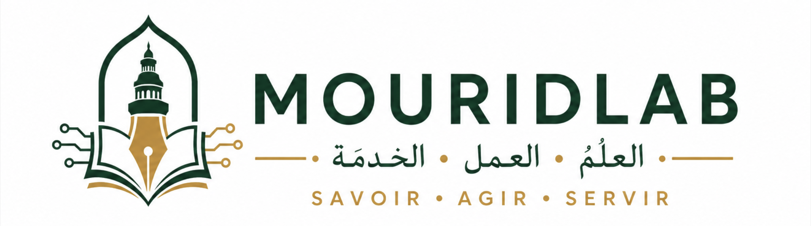

<div align="center">



### العِلْمُ · العَمَلُ · الخِدْمَةُ

**LEARN · ACT · SERVE**

<br>

[Français](README.md) · [Wolof](README.wo.md) · **English**

</div>

---

## Knowledge that is accessible and verifiable

MouridLab is an open-source community building digital resources and tools dedicated to the **Murid intellectual heritage**.

Our ambition is to preserve works, document them carefully, and enable everyone to study them through clearly identified sources.

## What we are building

| | Project | Purpose | Status |
| --- | --- | --- | --- |
| 📚 | **Mourid Library** | Bring works, editions, scans, transcriptions, and translations together in a structured library. | In development |
| 🔎 | **Mourid Search** | Explore the Arabic, Wolof, and French corpus through full-text and semantic search. | In preparation |
| 🧠 | **Mourid RAG** | Generate answers that point back to the passages, works, and editions used. | Experimental |
| 🔤 | **Mourid NLP** | Build tools for OCR, transliteration, alignment, and language processing across the corpus. | Planned |

## Technology in service of the sources

Every resource should remain connected to its context:

```text
Work → Edition → Document → Transcription → Translation → Data → Tools
```

Our commitments:

- **Traceability** — connect content to its original document and edition.
- **Transparency** — distinguish originals from corrections, translations, and digital transformations.
- **Rigor** — clearly identify uncertain information and attributions.
- **Responsible AI** — use artificial intelligence as an exploration tool, never as a source.
- **Openness** — document and share methods, data, and tools whenever rights permit.

## Contribute

Developers, researchers, students, translators, linguists, archivists, and designers can all take part.

You can contribute code, transcriptions, translations, source identification, passage verification, documentation, or design.

1. Browse our repositories and open issues.
2. Look for the `good first issue` and `help wanted` labels.
3. Introduce your idea in Discussions when it would benefit from early feedback.
4. Submit your change through a pull request.

> Every contribution matters: finding a reference or correcting a single line can improve the corpus for everyone.

## Propose an initiative

MouridLab can host projects involving Arabic OCR, Wolof language technology, audio, datasets, knowledge graphs, APIs, or educational applications.

Share the need, the available sources, and the intended audience in Discussions to develop the project with the community.

---

<div align="center">

### LEARN · ACT · SERVE

**Preserve · Understand · Share**

Explore the repositories · Join the discussions · Make a contribution

<sub>This motto is inspired by the teachings of Cheikh Ahmadou Bamba; it is not presented as a literal quotation.</sub>

</div>
